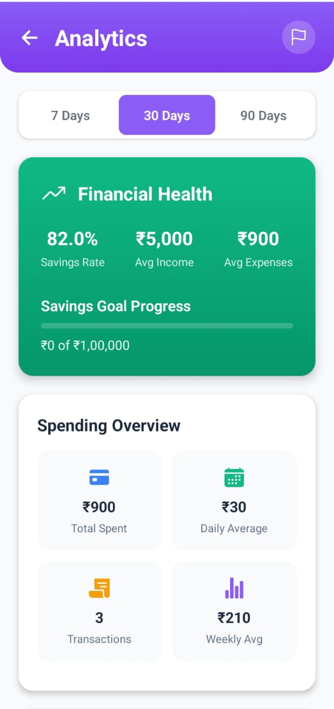
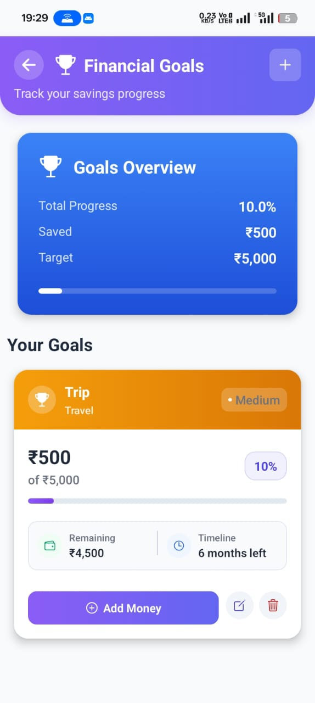
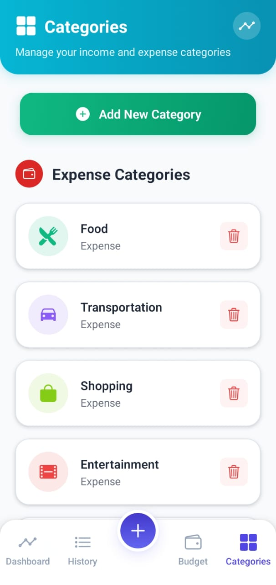
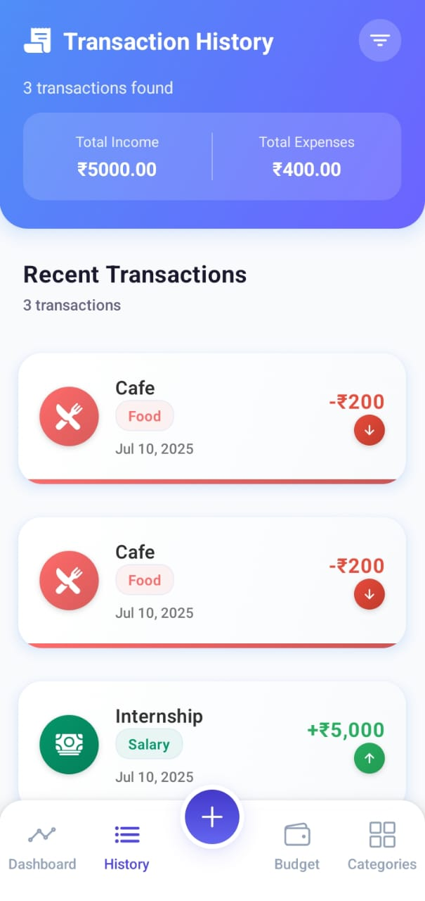
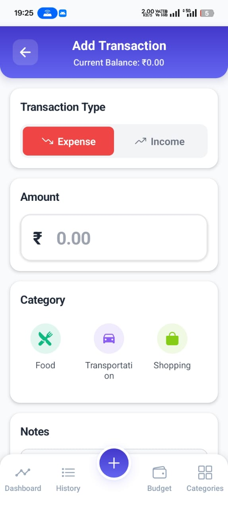

# FinGuard - Personal Finance Management App


A comprehensive React Native Expo application for managing personal finances on Android devices. FinGuard helps you track expenses, manage budgets, set financial goals, and gain insights into your spending patterns with beautiful visualizations.

---

## 📱 App Screenshots

### Categories Management


Manage your income and expense categories with custom icons and colors. Add, edit, or delete categories to match your financial habits.

### Transaction History


View all your transactions with filtering options. See total income vs expenses at a glance and track your spending patterns over time.

### Add Transaction


Easily add new income or expense transactions with category selection, amount input, and optional notes. The interface is intuitive and user-friendly.

### Analytics Dashboard


Get detailed insights into your financial health with savings rate, spending overview, and various metrics displayed in beautiful charts and cards.

### Financial Goals


Set and track your financial goals with progress indicators. Monitor your savings progress and stay motivated to achieve your targets.

---

## 🚀 Key Features

### 💰 Comprehensive Financial Tracking
- **Transaction Management**: Add, edit, and categorize income and expenses
- **Real-time Balance**: Current balance displayed prominently
- **Category-based Organization**: Organize transactions by custom categories
- **Visual Transaction Cards**: Easy-to-read transaction display with icons and colors

### 📊 Advanced Analytics
- **Financial Health Score**: Track your overall financial wellness
- **Savings Rate Calculation**: Monitor your savings percentage
- **Spending Patterns**: Analyze daily, weekly, and monthly spending trends
- **Category Breakdown**: See where your money goes with detailed insights

### 🎯 Goal Setting & Tracking
- **Custom Financial Goals**: Set savings targets for specific purposes
- **Progress Tracking**: Visual progress bars and percentage completion
- **Goal Categories**: Organize goals by type (Travel, Emergency Fund, etc.)
- **Timeline Management**: Set deadlines and track progress over time

### 🏷️ Smart Categorization
- **Pre-defined Categories**: Food, Transportation, Shopping, Entertainment, etc.
- **Custom Categories**: Create your own categories with custom icons
- **Icon Selection**: Choose from a variety of colorful icons
- **Expense vs Income**: Separate categorization for better organization

### 🔐 Secure Authentication
- **Biometric Authentication**: Face ID or Fingerprint login (primary method)
- **Device Security**: Secure local data storage using AsyncStorage
- **Privacy First**: No email/password required - purely biometric access
- **Data Protection**: All financial data stays on your device

### 📱 Modern User Experience
- **Intuitive Design**: Clean, modern interface with smooth animations
- **Bottom Navigation**: Easy access to all main features
- **Responsive Layout**: Optimized for various Android screen sizes
- **Loading States**: Smooth loading animations and feedback
- **Custom Alerts**: System-wide alert notifications for important events

## 🛠️ Technology Stack

- **React Native** with **Expo SDK 53**
- **JavaScript/JSX** for development
- **NativeWind** (Tailwind CSS for React Native) for styling
- **React Navigation** for navigation (Bottom Tabs + Stack)
- **Expo Vector Icons** for comprehensive iconography
- **React Native Chart Kit** for data visualization
- **AsyncStorage** for local data persistence
- **Expo Local Authentication** for biometric authentication
- **Expo Notifications** for push notifications
- **Expo SecureStore** for secure credential storage

---

## 📂 Project Structure

```
FinGuard/
├── src/
│   ├── components/                 # Reusable UI components
│   │   ├── Button.js              # Custom button component
│   │   ├── Card.js                # Card container component
│   │   ├── Input.js               # Form input component
│   │   ├── StatCard.js            # Statistics display component
│   │   ├── TransactionItem.js     # Transaction list item
│   │   ├── ExpenseAnalysisSummary.js # Expense analysis component
│   │   ├── ExpenseSummaryChart.js # Chart component
│   │   ├── FinancialTip.js        # Financial tips component
│   │   ├── MonthlyBudgetCard.js   # Budget card component
│   │   ├── CustomAlert.js         # Custom alert system
│   │   └── index.js               # Component exports
│   ├── screens/                   # Application screens
│   │   ├── DashboardScreen.js     # Main dashboard
│   │   ├── AddTransactionScreen.js # Add new transactions
│   │   ├── TransactionHistory.js  # Transaction history
│   │   ├── BudgetScreen.js        # Budget management
│   │   ├── CategoriesScreen.js    # Category management
│   │   ├── GoalsScreen.js         # Financial goals
│   │   ├── AnalyticsScreen.js     # Analytics and insights
│   │   └── AuthScreen.js          # Biometric authentication
│   ├── navigation/                # Navigation setup
│   │   └── AppNavigator.js        # Main navigation configuration
│   ├── services/                  # Business logic and data services
│   │   ├── storageService.js      # Data persistence service
│   │   ├── authService.js         # Authentication service
│   │   ├── notificationService.js # Notification handling
│   │   └── dataService.js         # Data management service
│   └── utils/                     # Utility functions and helpers
│       ├── colors.js              # Color constants
│       └── eventEmitter.js        # Event management
├── assets/                        # Images, fonts, and static assets
│   ├── icon.png                   # App icon
│   ├── splash-icon.png            # Splash screen icon
│   ├── adaptive-icon.png          # Android adaptive icon
│   └── favicon.png                # Web favicon
├── android/                       # Android-specific configuration
├── App.js                         # Main application component
├── global.css                     # Global Tailwind CSS styles
├── app.json                       # Expo configuration
├── babel.config.js                # Babel configuration
├── metro.config.js                # Metro bundler configuration
├── eas.json                       # EAS Build configuration
└── package.json                   # Dependencies and scripts
```

---

## 🚀 Installation & Setup

### Prerequisites
- Node.js (v16 or higher)
- npm or yarn
- Android Studio (for Android development)
- Expo CLI

### Setup Instructions

1. **Clone the repository**
   ```bash
   git clone https://github.com/satyaranjan2005/FinGuard.git
   cd FinGuard
   ```

2. **Install dependencies**
   ```bash
   npm install
   ```

3. **Start the development server**
   ```bash
   npx expo start
   ```

4. **Run on device/emulator**
   - Scan the QR code with Expo Go app (Android)
   - Or run `npx expo run:android` for development build

5. **Build for production**
   ```bash
   eas build -p android --profile preview
   ```

---

## 📱 App Features in Detail

### Authentication Flow
- **Biometric-Only Access**: Uses Face ID or Fingerprint for secure login
- **No Email/Password**: Simplified authentication without traditional credentials
- **Device Security**: Leverages device-level security features
- **Automatic Login**: Remembers authentication state securely

### Transaction Management
- **Quick Add**: Fast transaction entry with category selection
- **Smart Categorization**: Intelligent category suggestions
- **Flexible Input**: Support for various transaction types
- **Edit/Delete**: Full CRUD operations on transactions
- **Bulk Operations**: Manage multiple transactions efficiently

### Budget Tracking
- **Monthly Budgets**: Set spending limits for different categories
- **Real-time Monitoring**: Track spending against budgets
- **Visual Indicators**: Color-coded progress bars
- **Budget Alerts**: Notifications when approaching limits
- **Historical Comparison**: Compare spending across months

### Analytics & Insights
- **Spending Patterns**: Identify trends in your expenses
- **Category Analysis**: See which categories consume most budget
- **Time-based Views**: Daily, weekly, monthly spending analysis
- **Savings Rate**: Track your savings percentage over time
- **Financial Health Score**: Overall financial wellness indicator

### Goal Management
- **Custom Goals**: Set personalized financial targets
- **Progress Tracking**: Visual progress indicators
- **Goal Categories**: Organize goals by type and priority
- **Timeline Management**: Set deadlines and milestones
- **Achievement Tracking**: Celebrate completed goals

---

## 🔒 Security & Privacy

### Data Protection
- **Local Storage**: All data stored locally on device using AsyncStorage
- **No Cloud Storage**: Your financial data never leaves your device
- **Biometric Security**: Face ID/Fingerprint protection for app access
- **Secure Authentication**: No email/password vulnerabilities
- **Data Encryption**: Sensitive data encrypted at rest

### Privacy First
- **No Data Collection**: We don't collect or transmit personal data
- **No Analytics**: No tracking or analytics services
- **Offline First**: App works completely offline
- **No Permissions**: Minimal permissions required
- **Full Control**: You own and control all your data

---

## 📊 Data Visualization

### Charts & Analytics
- **Spending Breakdown**: Pie charts for category-wise expenses
- **Trend Analysis**: Line charts for spending over time
- **Savings Progress**: Visual progress bars for goals
- **Financial Health**: Comprehensive health score calculation
- **Comparative Analysis**: Month-over-month comparisons

### Insights & Reports
- **Automated Insights**: Smart analysis of spending patterns
- **Financial Tips**: Personalized recommendations
- **Goal Progress**: Track progress toward financial objectives
- **Budget Performance**: Compare actual vs planned spending
- **Savings Rate**: Calculate and track savings percentage

---

## 🎯 Financial Goals

### Goal Types
- **Savings Goals**: Build emergency funds, vacation funds
- **Expense Goals**: Reduce spending in specific categories
- **Investment Goals**: Track investment contributions
- **Debt Goals**: Monitor debt reduction progress
- **Custom Goals**: Create personalized financial targets

### Progress Tracking
- **Visual Progress**: Beautiful progress bars and percentages
- **Timeline Management**: Set deadlines and milestones
- **Achievement Notifications**: Celebrate goal completions
- **Motivation System**: Stay motivated with progress updates
- **Goal Categories**: Organize goals by importance and type

---

## 📱 Download & Links

### Download APK
- **Latest Release**: [Download FinGuard APK](https://expo.dev/accounts/satyaranjan2005/projects/finguard/builds/0df466ca-9f21-4826-8c43-a50dcdf6d76a)
- **System Requirements**: Android 5.0+ (API level 21)
- **File Size**: ~82MB
- **Installation**: Enable "Install from Unknown Sources" in Android settings

### Links
- **GitHub Repository**: [https://github.com/satyaranjan2005/FinGuard](https://github.com/satyaranjan2005/FinGuard)
- **Developer Profile**: [Satya Ranjan on LinkedIn](https://www.linkedin.com/in/satyaranjan2005/)
- **Issue Tracker**: [Report Bugs](https://github.com/satyaranjan2005/FinGuard/issues)

---

## 🛠️ Development & Technical Details

### Build Configuration
- **EAS Build**: Optimized for Expo Application Services
- **Android Target**: API level 21+ (Android 5.0+)
- **Bundle Size**: Optimized for minimal app size
- **Performance**: Optimized for smooth 60fps performance

### Code Quality
- **Modern JavaScript**: ES6+ features and best practices
- **Component Architecture**: Reusable, maintainable components
- **Error Handling**: Comprehensive error handling and validation
- **Code Organization**: Clean, logical file structure
- **Documentation**: Well-documented codebase

### Testing
- **Manual Testing**: Thoroughly tested on multiple Android devices
- **Performance Testing**: Optimized for various screen sizes
- **Security Testing**: Validated biometric authentication flow
- **User Experience Testing**: Refined based on user feedback

---

## 🚀 Performance & Optimization

### App Performance
- **Fast Loading**: Optimized startup time
- **Smooth Animations**: 60fps animations and transitions
- **Memory Management**: Efficient memory usage
- **Battery Optimization**: Minimal battery impact
- **Storage Efficiency**: Optimized data storage

### User Experience
- **Intuitive Navigation**: Easy-to-use bottom tab navigation
- **Responsive Design**: Works on all Android screen sizes
- **Accessibility**: Support for accessibility features
- **Offline Support**: Full functionality without internet
- **Quick Actions**: Fast access to common operations

---

## 🔄 Future Enhancements

### Planned Features
- **Cloud Backup**: Optional cloud synchronization
- **Export Functionality**: PDF and CSV export options
- **Recurring Transactions**: Automated recurring entries
- **Bill Reminders**: Notifications for upcoming bills
- **Investment Tracking**: Portfolio and investment monitoring
- **Multi-Currency**: Support for multiple currencies
- **Family Sharing**: Shared family financial management
- **Advanced Analytics**: Machine learning insights

### Technical Improvements
- **iOS Support**: Expand to iOS platform
- **Widget Support**: Home screen widgets
- **Voice Commands**: Voice-activated transaction entry
- **OCR Integration**: Receipt scanning and parsing
- **API Integration**: Bank account integration
- **Real-time Sync**: Multi-device synchronization

---

## 📖 User Guide

### Getting Started
1. **Install the App**: Download and install the APK file
2. **Set Up Biometric**: Configure Face ID or Fingerprint access
3. **Add Categories**: Create or customize expense categories
4. **Record Transactions**: Start adding your income and expenses
5. **Set Goals**: Define your financial objectives
6. **Monitor Progress**: Track your spending and savings

### Best Practices
- **Regular Updates**: Record transactions regularly for accuracy
- **Category Consistency**: Use consistent categories for better insights
- **Goal Setting**: Set realistic and achievable financial goals
- **Review Analytics**: Regularly check your financial health
- **Budget Planning**: Use budget features to control spending

---

## 🤝 Contributing

We welcome contributions from the community! Here's how you can help:

### Ways to Contribute
- **Bug Reports**: Report issues and bugs
- **Feature Requests**: Suggest new features
- **Code Contributions**: Submit pull requests
- **Documentation**: Improve documentation
- **Testing**: Test on different devices

### Development Setup
1. Fork the repository
2. Create a feature branch (`git checkout -b feature/amazing-feature`)
3. Make your changes
4. Test thoroughly
5. Commit your changes (`git commit -m 'Add amazing feature'`)
6. Push to the branch (`git push origin feature/amazing-feature`)
7. Open a Pull Request

### Code Guidelines
- Follow React Native best practices
- Use meaningful variable and function names
- Add comments for complex logic
- Ensure code is properly formatted
- Test on Android devices before submitting

---

## 📞 Support & Contact

### Getting Help
- **GitHub Issues**: [Report bugs or request features](https://github.com/satyaranjan2005/FinGuard/issues)
- **Documentation**: Check this README for comprehensive information
- **Community**: Join discussions in GitHub Discussions

### Contact Information
- **Developer**: Satya Ranjan
- **LinkedIn**: [https://www.linkedin.com/in/satyaranjan2005/](https://www.linkedin.com/in/satyaranjan2005/)
- **Email**: Available through LinkedIn
- **Response Time**: Usually within 24-48 hours

---

## 📄 License

This project is licensed under the MIT License - see the [LICENSE](LICENSE) file for details.

### MIT License Summary
- ✅ Commercial use allowed
- ✅ Modification allowed
- ✅ Distribution allowed
- ✅ Private use allowed
- ❌ Liability and warranty not provided

---

## 🙏 Acknowledgments

### Special Thanks
- **Expo Team**: For the amazing React Native framework
- **React Native Community**: For excellent libraries and tools
- **Beta Testers**: For valuable feedback and testing
- **Open Source Community**: For inspiration and resources

### Third-Party Libraries
- React Navigation for navigation
- Expo Vector Icons for beautiful icons
- React Native Chart Kit for data visualization
- AsyncStorage for local data persistence
- Expo Local Authentication for biometric security

---

## 📊 Project Statistics

### Development Stats
- **Lines of Code**: 5,000+
- **Components**: 15+ reusable components
- **Screens**: 8 main screens
- **Features**: 25+ core features
- **Development Time**: 3+ months

### App Stats
- **Supported Devices**: Android 5.0+
- **App Size**: ~50MB
- **Performance**: 60fps smooth animations
- **Battery Impact**: Minimal
- **Offline Support**: 100% functional offline

---

## 🎖️ Skills Demonstrated

This project demonstrates proficiency in:

### Technical Skills
- **React Native Development**
- **Expo Framework**
- **JavaScript/ES6+**
- **Mobile App Development**
- **Android Development**
- **State Management**
- **Navigation Systems**
- **Data Persistence**
- **Authentication Systems**
- **UI/UX Design**

### Soft Skills
- **Problem Solving**
- **Project Management**
- **User Experience Design**
- **Testing & Debugging**
- **Documentation**
- **Version Control (Git)**
- **Performance Optimization**
- **Security Best Practices**

---

**FinGuard** - Your Personal Finance Guardian 🛡️💰

*Take control of your finances with intelligent tracking, insightful analytics, and goal-oriented savings management.*
